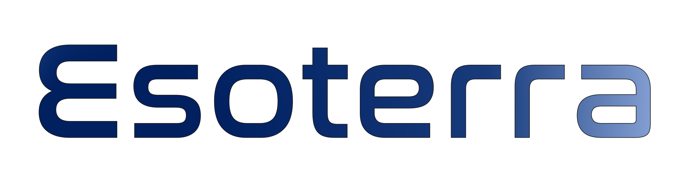

# Esoterra

<h3 align="center">
  
</h3>

## ECS657U - Multi-Platform Game Development Project
### Group AC : Vladislavas Gavinas, Amin Ullah, Shona Lowden

 

## Third Party Assets

### Audio
- [ATH-3-NA Voice](https://texttospeechrobot.com/texttospeechdownloadmp3.html)
- [Décompression.wav](https://freesound.org/people/davidou/sounds/88495/)
- [freeSFX](https://freesfx.co.uk/Default.aspx)

### Fonts
- [Nasalization](https://www.dafont.com/nasalization.font)

### Interactable Objects
- [Silicon](https://assetstore.unity.com/packages/3d/props/ball-pack-446)
- [Iron](https://assetstore.unity.com/packages/3d/props/medieval-gold-14162)
- [Aluminium, Carbon](https://assetstore.unity.com/packages/3d/environments/sci-fi/sci-fi-objects-pack-1-170478)
- [Blue Matter, Health Globe](https://assetstore.unity.com/packages/vfx/particles/powerup-particles-16458)

### Interface
- [Crosshair](https://kenney.nl/assets/crosshair-pack)

### Level Design
- [Modular Sci-Fi Corridor](https://assetstore.unity.com/packages/3d/environments/sci-fi/modular-sci-fi-corridor-142811)
- [Sci-Fi Styled Modular Pack](https://assetstore.unity.com/packages/3d/environments/sci-fi/sci-fi-styled-modular-pack-82913)
- [SpaceSkies Free](https://assetstore.unity.com/packages/2d/textures-materials/sky/spaceskies-free-80503)

### Miscellaneous
- [NavMeshComponents](https://github.com/Unity-Technologies/NavMeshComponents)
- [Sci-Fi Weapons](https://devassets.com/assets/sci-fi-weapons/)
- [Json.Net.Unity3D](https://github.com/SaladLab/Json.Net.Unity3D)
